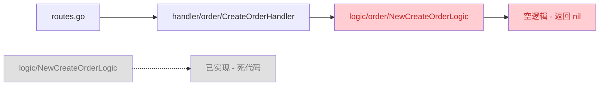

# Zero-Demo 项目代码审查报告

## 一、项目概览

项目基于 go-zero 微服务框架构建，包含以下服务：

| 服务 | 类型 | 职责 |
|------|------|------|
| gateway-api | API | 统一入口，路由分发、鉴权、限流 |
| user-api | API | 用户服务（登录、注册） |
| user-rpc | RPC | 用户数据管理 |
| notification-rpc | RPC | 通知服务（站内信、短信、邮件） |
| product-rpc | RPC | 商品服务 |
| order-rpc | RPC | 订单服务 |
| payment-rpc | RPC | 支付服务 |

---

## 二、严重问题（Critical）

### 2.1 Gateway 层大量空逻辑文件

**问题描述**：`routes.go` 注册的路由使用的是子目录 handler（如 `order.CreateOrderHandler`），而这些 handler 引用了子目录逻辑包（如 `logic/order`），但子目录逻辑文件全是空模板代码（仅有 `// todo` 注释）。同时，`logic/` 目录下存在已实现的扁平化逻辑文件（如 `createorder_logic.go`），但这些是**死代码**，不会被调用。

**调用链路分析**：


**影响范围**：以下接口完全不可用（返回空响应）：
- `/api/v1/product/create`、`/api/v1/product/:id`、`/api/v1/product/list`、`/api/v1/product/update`、`/api/v1/product/delete`
- `/api/v1/order/:id`、`/api/v1/order/list`
- `/api/v1/payment/:id`、`/api/v1/payment/list`

**问题文件**（空逻辑，正在被调用）：
- [createproductlogic.go](file:///d:/work/zero-demo/app/gateway/api/internal/logic/product/createproductlogic.go)
- [updateproductlogic.go](file:///d:/work/zero-demo/app/gateway/api/internal/logic/product/updateproductlogic.go)
- [deleteproductlogic.go](file:///d:/work/zero-demo/app/gateway/api/internal/logic/product/deleteproductlogic.go)
- [getproductlogic.go](file:///d:/work/zero-demo/app/gateway/api/internal/logic/product/getproductlogic.go)
- [listproductlogic.go](file:///d:/work/zero-demo/app/gateway/api/internal/logic/product/listproductlogic.go)
- [createorderlogic.go](file:///d:/work/zero-demo/app/gateway/api/internal/logic/order/createorderlogic.go)
- [getorderlogic.go](file:///d:/work/zero-demo/app/gateway/api/internal/logic/order/getorderlogic.go)
- [listorderlogic.go](file:///d:/work/zero-demo/app/gateway/api/internal/logic/order/listorderlogic.go)
- [createpaymentlogic.go](file:///d:/work/zero-demo/app/gateway/api/internal/logic/payment/createpaymentlogic.go)
- [getpaymentlogic.go](file:///d:/work/zero-demo/app/gateway/api/internal/logic/payment/getpaymentlogic.go)
- [listpaymentlogic.go](file:///d:/work/zero-demo/app/gateway/api/internal/logic/payment/listpaymentlogic.go)

**死代码文件**（已实现，但不被调用）：
- [createorder_logic.go](file:///d:/work/zero-demo/app/gateway/api/internal/logic/createorder_logic.go)
- [createpayment_logic.go](file:///d:/work/zero-demo/app/gateway/api/internal/logic/createpayment_logic.go)
- [createproduct_logic.go](file:///d:/work/zero-demo/app/gateway/api/internal/logic/createproduct_logic.go)
- [deleteproduct_logic.go](file:///d:/work/zero-demo/app/gateway/api/internal/logic/deleteproduct_logic.go)
- [getorder_logic.go](file:///d:/work/zero-demo/app/gateway/api/internal/logic/getorder_logic.go)
- [getpayment_logic.go](file:///d:/work/zero-demo/app/gateway/api/internal/logic/getpayment_logic.go)
- [getproduct_logic.go](file:///d:/work/zero-demo/app/gateway/api/internal/logic/getproduct_logic.go)
- [listorder_logic.go](file:///d:/work/zero-demo/app/gateway/api/internal/logic/listorder_logic.go)
- [listpayment_logic.go](file:///d:/work/zero-demo/app/gateway/api/internal/logic/listpayment_logic.go)
- [listproduct_logic.go](file:///d:/work/zero-demo/app/gateway/api/internal/logic/listproduct_logic.go)
- [updateproduct_logic.go](file:///d:/work/zero-demo/app/gateway/api/internal/logic/updateproduct_logic.go)

**修复建议**：选择以下方案之一：
- **方案 A**：删除子目录的 handler 和 logic 文件，修改 `routes.go` 使用扁平化的 handler
- **方案 B**：删除扁平化的 handler 和 logic 文件，补全子目录的逻辑文件（推荐）

---

### 2.2 创建订单时缺少用户 ID 传递

**问题描述**：`order-rpc` 的 `Create` 方法需要 `UserId` 参数，但已实现的 `logic/createorder_logic.go`（死代码）没有从 JWT Token 中解析用户 ID 并传递给 RPC。如果按方案 A 修复，这个问题会成为运行时问题。

**问题代码**：
```go
// app/gateway/api/internal/logic/createorder_logic.go
func (l *CreateOrderLogic) CreateOrder(req *types.CreateOrderReq) (*types.CreateOrderResp, error) {
    items := make([]*order.OrderItem, 0, len(req.Items))
    for _, item := range req.Items {
        items = append(items, &order.OrderItem{...})
    }
    // ❌ 没有传递 UserId
    resp, err := l.svcCtx.OrderRpc.Create(l.ctx, &order.CreateOrderReq{Items: items})
    ...
}
```

**问题文件**：[createorder_logic.go](file:///d:/work/zero-demo/app/gateway/api/internal/logic/createorder_logic.go)

**修复建议**：
```go
func (l *CreateOrderLogic) CreateOrder(req *types.CreateOrderReq) (*types.CreateOrderResp, error) {
    items := make([]*order.OrderItem, 0, len(req.Items))
    for _, item := range req.Items {
        items = append(items, &order.OrderItem{...})
    }
    userId := jwtx.UserIDFromCtx(l.ctx)
    resp, err := l.svcCtx.OrderRpc.Create(l.ctx, &order.CreateOrderReq{
        UserId: userId,
        Items:  items,
    })
    ...
}
```

---

### 2.3 创建支付时缺少用户 ID 和订单号传递

**问题描述**：`payment-rpc` 的 `Create` 方法需要 `UserId` 和 `OrderNo` 参数，但已实现的 `logic/createpayment_logic.go`（死代码）没有传递这些参数。

**问题代码**：
```go
// app/gateway/api/internal/logic/createpayment_logic.go
func (l *CreatePaymentLogic) CreatePayment(req *types.CreatePaymentReq) (*types.CreatePaymentResp, error) {
    // ❌ 缺少 UserId 和 OrderNo
    resp, err := l.svcCtx.PaymentRpc.Create(l.ctx, &payment.CreatePaymentReq{
        OrderId: req.OrderId,
        Amount:  req.Amount,
        Method:  payment.PaymentMethod(req.Method),
    })
    ...
}
```

**问题文件**：[createpayment_logic.go](file:///d:/work/zero-demo/app/gateway/api/internal/logic/createpayment_logic.go)

**修复建议**：在调用 RPC 前先查询订单获取 OrderNo，并从 JWT 获取 UserId。

---

### 2.4 库存扣减存在并发竞态条件

**问题描述**：`order-rpc` 的创建订单逻辑中，先循环查询每个商品的库存，然后再循环扣减库存。在高并发场景下，两个请求可能同时通过库存检查，但扣减时库存已不足。

**问题代码**：
```go
// app/order/rpc/internal/logic/create_logic.go
for _, item := range in.Items {
    // 第一步：检查库存
    productInfo, err := l.svcCtx.ProductRpc.Get(l.ctx, &product.GetProductReq{Id: item.ProductId})
    if productInfo.Product.Stock < item.Quantity {
        return nil, status.Error(codes.InvalidArgument, "库存不足")
    }
    ...
}
for _, item := range in.Items {
    // 第二步：扣减库存（此时可能已被其他请求扣减）
    if _, err := l.svcCtx.ProductRpc.DeductStock(l.ctx, &product.DeductStockReq{Id: item.ProductId, Amount: item.Quantity}); err != nil {
        return nil, status.Error(codes.Internal, "扣减库存失败")
    }
}
```

**问题文件**：[create_logic.go](file:///d:/work/zero-demo/app/order/rpc/internal/logic/create_logic.go)

**修复建议**：
1. 使用数据库事务包裹整个流程
2. 或者在扣减库存时直接判断（当前实现的 `DeductStock` SQL 已有 `WHERE stock >= ?`，但错误提示不够明确）
3. 推荐方案：合并检查和扣减为一个原子操作，或使用分布式锁

---

### 2.5 RabbitMQ 消费者缺失

**问题描述**：`notification-rpc` 的 `SendLogic` 将通知消息发送到 RabbitMQ，但项目中没有对应的消费者来处理这些消息（短信、邮件、推送）。

**问题文件**：[send_logic.go](file:///d:/work/zero-demo/app/notification/rpc/internal/logic/send_logic.go)

**修复建议**：在 `notification-rpc` 中实现消费者，监听队列并根据 `channel` 字段调用对应的发送器（`pkg/sender/sms.go`、`pkg/sender/email.go`）。

---

## 三、中等问题（Major）

### 3.1 限流中间件存在内存泄漏风险

**问题描述**：`RateLimitMiddleware` 使用 `map[string]*rate.Limiter` 存储每个 IP 的限流器，但没有清理机制。随着时间推移，map 会持续增长，导致内存泄漏。

**问题代码**：
```go
// app/gateway/api/internal/middleware/ratelimitmiddleware.go
type RateLimitMiddleware struct {
    rate    rate.Limit
    burst   int
    mu      sync.Mutex
    buckets map[string]*rate.Limiter // ❌ 无清理机制
}
```

**问题文件**：[ratelimitmiddleware.go](file:///d:/work/zero-demo/app/gateway/api/internal/middleware/ratelimitmiddleware.go)

**修复建议**：添加定时清理机制，定期清理长时间未使用的限流器（如超过 5 分钟无请求）。

---

### 3.2 订单创建失败时库存未回滚

**问题描述**：`order-rpc` 的创建订单流程中，先扣减库存再插入订单。如果订单插入失败，库存已经被扣减但不会回滚。

**问题代码**：
```go
// app/order/rpc/internal/logic/create_logic.go
// 先扣减库存
for _, item := range in.Items {
    if _, err := l.svcCtx.ProductRpc.DeductStock(...); err != nil {
        return nil, status.Error(codes.Internal, "扣减库存失败")
    }
}
// 再创建订单（如果失败，库存已扣减）
res, err := l.svcCtx.OrderModel.Insert(l.ctx, &model.Order{...})
```

**问题文件**：[create_logic.go](file:///d:/work/zero-demo/app/order/rpc/internal/logic/create_logic.go)

**修复建议**：
1. 使用分布式事务（如 Seata）
2. 或采用"先创建订单，再扣减库存"的模式
3. 或实现补偿机制（订单创建失败时自动恢复库存）

---

### 3.3 订单号生成存在重复风险

**问题描述**：`generateOrderNo` 使用 `UnixMilli()` 作为订单号，如果同一毫秒内有多个请求，可能生成重复的订单号。

**问题代码**：
```go
// app/order/rpc/internal/logic/create_logic.go
func generateOrderNo() string {
    return "ORD" + strconv.FormatInt(time.Now().UnixMilli(), 10)
}
```

**问题文件**：[create_logic.go](file:///d:/work/zero-demo/app/order/rpc/internal/logic/create_logic.go)

**修复建议**：添加分布式唯一 ID 生成器（如雪花算法）或 UUID。

---

### 3.4 支付创建时缺少订单信息验证

**问题描述**：`payment-rpc` 的 `Create` 方法检查了订单状态和金额，但没有验证订单的用户 ID 与当前用户是否匹配，存在越权支付风险。

**问题代码**：
```go
// app/payment/rpc/internal/logic/create_logic.go
orderInfo, err := l.svcCtx.OrderRpc.Get(l.ctx, &order.GetOrderReq{Id: in.OrderId})
if err != nil {
    return nil, status.Error(codes.NotFound, "订单不存在")
}
// ❌ 没有验证 orderInfo.Order.UserId == in.UserId
```

**问题文件**：[create_logic.go](file:///d:/work/zero-demo/app/payment/rpc/internal/logic/create_logic.go)

**修复建议**：添加用户 ID 匹配校验。

---

### 3.5 Go 版本号不正确

**问题描述**：`go.mod` 中指定的 Go 版本为 `1.25.5`，但截至 2026 年 7 月，该版本尚未发布（当前最新稳定版本为 1.23.x）。

**问题文件**：[go.mod](file:///d:/work/zero-demo/go.mod)

**修复建议**：将版本号修改为实际使用的版本，如 `go 1.23`。

---

## 四、代码结构问题（Minor）

### 4.1 重复的逻辑文件

**问题描述**：`app/gateway/api/internal/logic/` 目录下同时存在扁平化的逻辑文件（已实现但未使用）和子目录（空模板但正在使用），结构混乱。

**问题文件**：
- `app/gateway/api/internal/logic/*.go`（已实现，死代码）
- `app/gateway/api/internal/logic/*/*.go`（空模板，正在使用）

**修复建议**：统一使用一种结构（见 2.1 节）。

---

### 4.2 缺少全局错误处理中间件

**问题描述**：项目缺少统一的错误处理中间件，错误信息直接返回给客户端，可能泄露内部实现细节。

**修复建议**：添加全局错误处理中间件，统一错误响应格式，隐藏敏感信息。

---

### 4.3 缺少请求日志中间件

**问题描述**：项目缺少请求日志中间件，无法追踪请求详情，不利于问题排查。

**修复建议**：添加请求日志中间件，记录请求方法、路径、耗时、状态码等信息。

---

## 五、安全问题（Security）

### 5.1 密码传输风险

**问题描述**：用户注册和登录接口在 HTTP 请求体中传输明文密码。

**问题文件**：[gateway.api](file:///d:/work/zero-demo/app/gateway/api/gateway.api)

**修复建议**：确保生产环境使用 HTTPS，避免密码明文传输。

---

### 5.2 JWT 密钥硬编码

**问题描述**：配置文件中 JWT 密钥有默认值，虽然支持环境变量覆盖，但默认值存在安全风险。

**问题代码**：
```yaml
# app/gateway/api/etc/gateway-api.yaml
Auth:
  AccessSecret: ${JWT_ACCESS_SECRET:zero-demo-user-api-secret-please-change}
```

**问题文件**：[gateway-api.yaml](file:///d:/work/zero-demo/app/gateway/api/etc/gateway-api.yaml)

**修复建议**：生产环境必须通过环境变量设置强密钥，建议删除默认值或使用更安全的生成方式。

---

## 六、总结

| 级别 | 数量 | 说明 |
|------|------|------|
| Critical | 5 | 空逻辑文件、缺少用户 ID 传递、并发竞态、消费者缺失 |
| Major | 5 | 内存泄漏、库存回滚、订单号重复、越权风险、Go 版本错误 |
| Minor | 3 | 代码结构、错误处理、请求日志 |
| Security | 2 | 密码传输、密钥硬编码 |

### 优先修复建议

1. **立即修复**：统一 handler/logic 结构，补全空逻辑文件，确保基本功能可用
2. **高优先级**：修复用户 ID 传递问题，确保业务数据完整性
3. **重要**：实现 RabbitMQ 消费者，确保通知功能正常工作
4. **必要**：修复并发竞态条件和库存回滚问题，确保数据一致性
5. **基础**：修正 go.mod 中的 Go 版本号

---

## 七、项目优点

1. **架构清晰**：采用 go-zero 微服务架构，API 层和 RPC 层分离，职责明确
2. **配置外部化**：支持环境变量 `${ENV_VAR:default}` 格式，便于不同环境部署
3. **延迟队列实现**：RabbitMQ 延迟队列采用死信交换机 + TTL 机制，设计合理
4. **基础设施完善**：包含 Nginx、ELK、Prometheus、Grafana 的 Docker Compose 配置
5. **测试覆盖**：`pkg/jwtx` 和 `pkg/sender` 已有单元测试